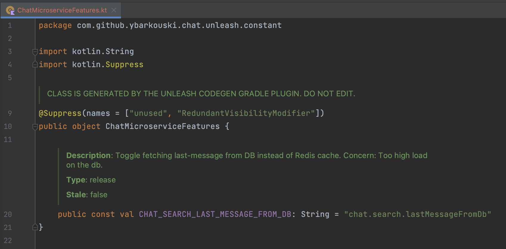

# Unleash Codegen Gradle Plugin [](https://plugins.gradle.org/plugin/com.superside.unleash.codegen)
> Gradle plugin for Unleash Feature Toggles code generation


## Reason
1. Increase the reliability of feature toggles, the default Unleash SDK rely on strings to identify the feature toggles, which is error-prone and hard to maintain.
2. See description, tags, and other meta information directly in the code, which improves the readability of feature toggles in general.
3. It's hard to maintain stale features once using pure Strings, this plugin will help to find out the stale features and remove them from the codebase.

## Notes
1. This plugin is not a replacement for the Unleash SDK, it is a code generation tool that generates the Unleash SDK code for you.
2. This plugin generates git-tracked sources, so the generation doesn't block developers that does not create new unleash features and doesn't want to export their Unleash Tokens.
3. It's suggested to use unleash-codegen together with ktlint gradle plugins (like [kotlinter](https://github.com/jeremymailen/kotlinter-gradle) or [ktlint-gradle](https://github.com/JLLeitschuh/ktlint-gradle)), to keep the generated code clean and readable. Example configuration:
    ```kotlin
   tasks.named("generateFeatures") {
       finalizedBy("formatKotlin")
   }
   ```

## Installation
You need to add the following lines to your `build.gradle.kts` file:
```kotlin
plugins { 
  id("com.superside.unleash.codegen") version "<latest version from the Gradle plugin portal>"
}
```

## Gradle Task
### Usage
```bash
gradle generateFeatures
```
### Plugin Extension properties
| Property      | Default           | Type          | Description                                | Required |
|---------------|-------------------|---------------|--------------------------------------------|---------|
| `url`         | `null`            | String        | Unleash API URL                            | *       |
| `token`       | `null`            | String        | [Unleash API Client Token](https://docs.getunleash.io/user_guide/api-token)                   | *       |
| `fileName`    | `Features`        | String?       | Name for generated features class          |         |
| `packageName` |               | String?       | Package name for the generated files       |         |
| `projects`    | `ALL`             | List\<String> | Unleash projects to generate Features from |         |

### Description
This task will generate a `$fileName.kt` file in the `$packageName` directory of your project. This file will contain all the feature toggles defined in your Unleash instance, filtered by `$projects` if set.

### Extension example
```kotlin
unleash {
  url = "https://app.unleash-hosted.com/random/api/"
  token = System.getenv("UNLEASH_TOKEN")
  fileName = "ChatMicroserviceFeatures"
  packageName = "com.superside.chat.unleash.constants"
  projects = listOf("chat")
}
```
### Generated Features example



## Building from source
You don’t need to build from source to use unleash-codegen, but if you want to try out the latest, unleash-codegen can be built and published to your local Maven cache using the Gradle wrapper.

You also need following to:
- Kotlin 1.6.21 or higher
- Gradle 7.x or higher 

```bash
./gradlew publishToMavenLocal
```

## License
Unleash codegen gradle plugin is released under version 2.0 of the Apache License.


